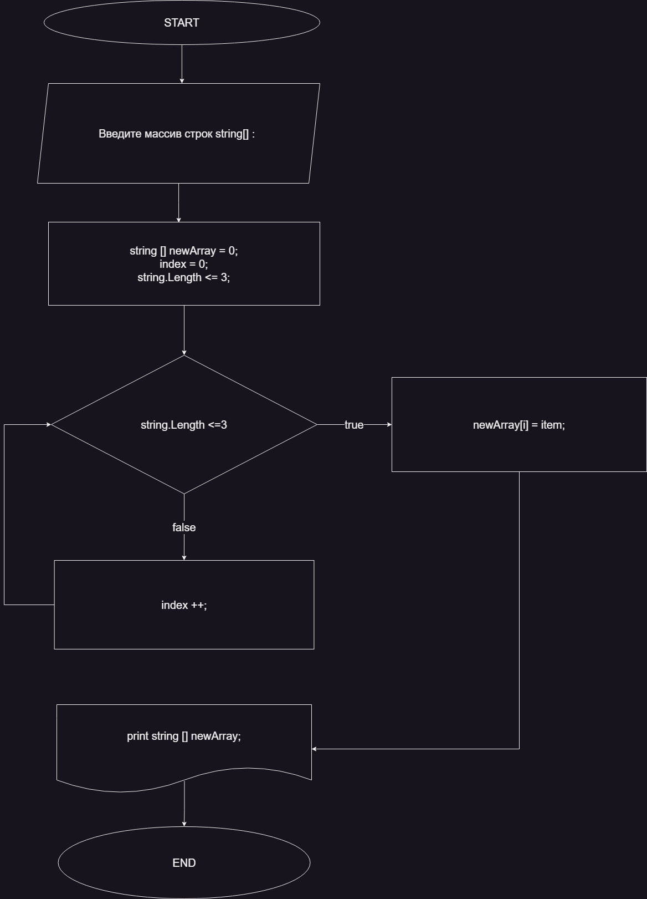

**Итоговая проверочная работа**

__**Задача:**__ 
    Написать программу, которая из имеющегося массива строк формирует массив из строк, длина которых меньше либо равна 3 символа. Первоначальный массив можно ввести с клавиатуры, либо задать на старте выполнения алгоритма. При решении не рекомендуется пользоваться коллекциями, лучше обойтись исключительно массивами.

__**Решение:**__ 
    Для решения задачи были созданы функции:
# CreateArray
# PrintArray
# LenghtStringCheck
# NewArray
_Для решения были созданы 2 ветки и выполнено их слияние._

